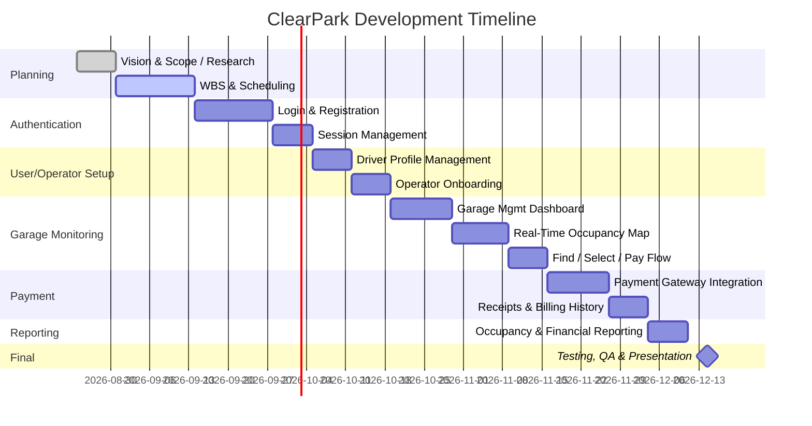

# ClearPark: Smart Parking Platform
### Project Document — WE ARE $oftware ¢orp.

**Course:** CIS 4374 — University of Houston
**Document Type:** Vision & Scope / Software Requirements Specification (Living Document)

---

## Version History

| Version | Date | Author | Summary of Changes |
|---------|------|--------|---------------------|
| 0.1 | Week 1 | David Thai | Initial draft: Research, Vision & Scope, and SRS draft (15+ use cases) created |
| 0.2 | Week 2 (Sept 17, 2026) | David Thai | Added Work Breakdown Structure (3+ levels) and draft project timeline with Gantt chart |

*(Update this table every week per course instructions — bump the version number and note what changed.)*

---

## Table of Contents

1. [Research: Competitive Analysis](#1-research-competitive-analysis)
2. [Vision and Scope](#2-vision-and-scope)
3. [Software Requirements Specification (Draft)](#3-software-requirements-specification-draft)
   - 3.1 [Use Case Diagram Overview](#31-use-case-overview)
   - 3.2 [Use Cases](#32-use-cases)
4. [Work Breakdown Structure (WBS)](#4-work-breakdown-structure-wbs)
5. [Project Timeline & Gantt Chart](#5-project-timeline--gantt-chart)
6. [References](#6-references)

---

## 1. Research: Competitive Analysis

### 1.1 Purpose

Before defining ClearPark's scope, WE ARE $oftware ¢orp. conducted a review of existing smart-parking products to understand the current market landscape, identify gaps, and determine how ClearPark will differentiate itself.

### 1.2 Existing Software Landscape

| Product | Focus | Strengths | Weaknesses |
|---|---|---|---|
| **ParkMobile** | On-street/metered parking, city partnerships | Largest zone coverage in the U.S. (500+ cities); deep integration with municipal parking systems and DOTs | Per-transaction convenience fees; limited focus on off-street garage reservations; GPS-based session tracking can fail to detect when a driver has left, leading to overcharges |
| **SpotHero** | Pre-booked garage/lot/event parking | Strong brand recognition ("#1 Rated Parking App"); partnerships (e.g., Apple Maps integration for 8,000+ locations); good filtering (EV charging, accessibility, valet) | Limited in smaller/secondary cities; pricing can surge between search and checkout, frustrating users |
| **ParkWhiz** | Garage reservations for events, airports, downtown | Deep discounts (up to 50%) for pre-booked spots; easy booking UX | Coverage concentrated in major metro/event markets; less useful for everyday commuter parking |
| **PayByPhone** | Metered/on-street payment, expanding internationally | Official partner in many cities; straightforward pay-by-phone metering | Convenience fees vary by city; minimal reservation or analytics features for operators |
| **Passport** | Municipal & university parking/transit management | Popular with smaller cities and university campuses; consolidates multiple permit/pass types in one app | Less brand recognition in large metros; feature depth varies city to city |
| **SpotAngels** | Community-driven free/street parking finder | Crowdsourced data helps avoid tickets and street-cleaning zones; free to use | No reservation or payment capability; relies on community data accuracy |

### 1.3 Common Pain Points Across Existing Solutions

- **Fragmentation** — drivers often need multiple apps depending on the city or lot (metered vs. garage vs. municipal).
- **Pricing transparency** — several platforms are criticized for prices shown in search differing from checkout totals once fees/surge pricing apply.
- **Session accuracy** — GPS-based auto-detection of arrival/departure is unreliable, causing billing disputes.
- **Operator-side tools** — most consumer-facing apps offer little for the parking facility operator (occupancy analytics, dynamic pricing controls, reporting).

### 1.4 Opportunity for Differentiation

ClearPark will differentiate itself by:

1. **Unifying** on-street, garage, and lot parking into a single real-time map/reservation experience (rather than specializing in only one, like most competitors).
2. Providing a genuine **operator-facing administrative dashboard** with occupancy analytics and pricing tools — a gap in most driver-first competitor apps.
3. Guaranteeing **transparent, locked-in pricing** at time of reservation to directly address the surge-pricing complaint common in competitor reviews.
4. Offering **built-in navigation hand-off** to external mapping/navigation services rather than requiring a separate app.

---

## 2. Vision and Scope

### 2.1 About WE ARE $oftware ¢orp.

WE ARE $oftware ¢orp. is a fictitious software development studio operating with a theoretically unlimited budget and staffed with dedicated teams across mobile, web, backend, mapping, payments, and QA. The studio was approached by a coalition of city transportation departments and independent parking garage operators who share a common problem: drivers can't find real-time parking availability, and operators lack modern digital tools to manage occupancy and pricing.

### 2.2 How This Project Was Acquired

City transportation departments and parking facility operators identified worsening downtown congestion linked directly to drivers circling in search of parking. An RFP (Request for Proposal) was issued for a unified platform that would serve both drivers and parking operators. WE ARE $oftware ¢orp. was selected to design, build, and deliver this platform over the course of the engagement, branded internally as **ClearPark**.

### 2.3 Project Overview

ClearPark is a web and mobile platform that allows drivers to locate, reserve, and pay for parking in real time, while giving parking operators the tools to manage occupancy, pricing, and reporting. The platform addresses a clear business need: drivers lose time and money circling for parking, and operators lack visibility into utilization of their own assets.

### 2.4 Vision Statement

> For drivers who waste time and money searching for parking, and for operators who lack visibility into their facilities, ClearPark is a unified parking platform that provides real-time availability, reservations, and payment in one place — unlike fragmented single-purpose competitor apps, ClearPark serves both sides of the market with transparent pricing and operator-grade analytics.

### 2.5 Project Scope

**In Scope (Semester Deliverable):**
- User registration/authentication
- Real-time parking availability + interactive map
- Reservation and digital payment processing
- Reservation history/receipts
- Notifications/alerts
- Administrative dashboard (occupancy reporting, analytics)
- Integration with third-party mapping/navigation APIs
- Integration with third-party payment providers

**Out of Scope (for now — may be revisited):**
- Autonomous vehicle valet/parking assist
- Physical hardware (sensors, gate systems) — assumed to be provided by facility operators or a future phase
- Dynamic city-wide traffic rerouting

### 2.6 Stakeholders

| Stakeholder | Interest |
|---|---|
| Drivers / vehicle owners | Fast, reliable way to find and pay for parking |
| Parking facility operators | Tools to manage occupancy, pricing, and reporting |
| City transportation departments | Reduced congestion, data on parking utilization |
| System administrators | Platform uptime, security, user management |
| Finance and billing personnel | Accurate transaction processing and reconciliation |
| Mobile application users | Seamless mobile experience |
| Third-party payment providers | Reliable integration and transaction volume |

### 2.7 Constraints

- Unlimited theoretical development budget, but a **fixed semester timeline**
- Dependence on third-party mapping and payment APIs
- Must comply with security/privacy regulations and city ordinances

---

## 3. Software Requirements Specification (Draft)

*This section is a living draft. It will grow week over week as requirements are elicited and refined, per the course's weekly document-update requirement.*

### 3.1 Use Case Overview

The initial use case set below covers the core driver-facing, operator-facing, and system-level interactions identified from the high-level requirements. Additional use cases will be added as stakeholder analysis continues.

**Actors:** Driver, Parking Operator, System Administrator, Payment Gateway (external), Mapping Service (external), System (automated).

### 3.2 Use Cases

| ID | Use Case Name | Primary Actor | Description |
|----|----|----|----|
| UC-01 | Register Account | Driver | Driver creates a new account with email/phone and profile details. |
| UC-02 | Log In | Driver | Registered driver authenticates to access the platform. |
| UC-03 | Search for Parking | Driver | Driver searches for parking near a destination via map or address. |
| UC-04 | View Real-Time Availability | Driver | Driver views live occupancy/availability for nearby facilities on an interactive map. |
| UC-05 | Reserve Parking Space | Driver | Driver selects a facility, time window, and confirms a reservation. |
| UC-06 | Cancel Reservation | Driver | Driver cancels an existing reservation prior to arrival. |
| UC-07 | Process Payment | Driver | Driver pays for a reservation or on-demand session digitally. |
| UC-08 | View Reservation History & Receipts | Driver | Driver reviews past reservations and downloads receipts. |
| UC-09 | Receive Notifications/Alerts | Driver | System sends alerts (e.g., reservation confirmation, expiration warning). |
| UC-10 | Navigate to Facility | Driver | Driver receives turn-by-turn navigation via integrated mapping service. |
| UC-11 | Rate/Review Parking Facility | Driver | Driver submits a rating/review after a completed session. |
| UC-12 | Manage Facility Inventory | Parking Operator | Operator adds/edits parking facilities, spaces, and hours of operation. |
| UC-13 | Set/Adjust Pricing | Parking Operator | Operator configures pricing rules (hourly, daily, dynamic) for a facility. |
| UC-14 | View Occupancy Reports & Analytics | Parking Operator | Operator views dashboards showing utilization trends and revenue. |
| UC-15 | Manage User Accounts | System Administrator | Admin manages driver/operator accounts, roles, and access. |
| UC-16 | Monitor System Health | System Administrator | Admin monitors uptime, error logs, and third-party API integration status. |
| UC-17 | Send Expiration Reminder | System | System automatically notifies a driver before a reservation/session expires. |
| UC-18 | Authorize Payment via Gateway | Payment Gateway | External payment provider authorizes and settles a transaction initiated by the platform. |

*(18 use cases identified — exceeds the 15-use-case minimum for this milestone. Each will be expanded into full flow-of-events detail as the SRS matures.)*

#### 3.2.1 Sample Expanded Use Case — UC-05: Reserve Parking Space

| Field | Detail |
|---|---|
| **ID / Name** | UC-05 — Reserve Parking Space |
| **Primary Actor** | Driver |
| **Preconditions** | Driver is logged in; at least one facility has available space matching the driver's search |
| **Trigger** | Driver selects a facility and time window from search results |
| **Main Flow** | 1. Driver selects a facility from the map/list. 2. System displays available time slots and price. 3. Driver selects a time window and confirms. 4. System requests payment authorization (see UC-07). 5. System confirms the reservation and sends a notification (UC-09). |
| **Alternate Flow** | If the selected slot becomes unavailable before confirmation, system notifies the driver and prompts them to select another slot. |
| **Postconditions** | A confirmed reservation exists; the space is held for the driver for the reserved window. |

---

## 4. Work Breakdown Structure (WBS)

The WBS below decomposes ClearPark into its five major components — Authentication, User/Operator Setup, Garage Monitoring (Dashboards), Payment, and Reporting — broken down at least three levels deep, per this week's assignment.

### 4.1 Authentication

- **1.0 Authentication**
  - 1.1 Login
    - 1.1.1 Design login UI
    - 1.1.2 Implement email/password authentication
    - 1.1.3 Implement "forgot password" flow
  - 1.2 Registration
    - 1.2.1 Design registration form
    - 1.2.2 Implement driver registration
    - 1.2.3 Implement operator registration
  - 1.3 Session Management
    - 1.3.1 Implement session token generation
    - 1.3.2 Implement token refresh / auto-logout on expiration

### 4.2 User / Operator Setup

- **2.0 User / Operator Setup**
  - 2.1 Driver Profile Management
    - 2.1.1 Create/edit profile
    - 2.1.2 Manage saved vehicle information
  - 2.2 Operator Account Setup
    - 2.2.1 Operator onboarding workflow
    - 2.2.2 Role & permission assignment
  - 2.3 Account Administration
    - 2.3.1 Admin tools to view/edit/deactivate accounts

### 4.3 Garage Monitoring (Dashboards)

- **3.0 Garage Monitoring / Dashboards**
  - 3.1 Garage Management (Add / Edit / Remove Garage)
    - 3.1.1 Add new garage facility (location, capacity, pricing)
    - 3.1.2 Edit garage details
    - 3.1.3 Deactivate/remove a garage
  - 3.2 Real-Time Occupancy Monitoring
    - 3.2.1 Integrate occupancy data feed/sensor API
    - 3.2.2 Build live occupancy map view
  - 3.3 Find Parking, Select, and Pay
    - 3.3.1 Build search/filter interface
    - 3.3.2 Build reservation selection flow
    - 3.3.3 Hand off to Payment checkout (see 4.0)

### 4.4 Payment

- **4.0 Payment**
  - 4.1 Payment Gateway Integration
    - 4.1.1 Select third-party payment provider
    - 4.1.2 Implement provider API integration
  - 4.2 Transaction Processing
    - 4.2.1 Process reservation/on-demand payments
    - 4.2.2 Handle refunds and cancellations
  - 4.3 Receipts & Billing History
    - 4.3.1 Generate digital receipts
    - 4.3.2 Build reservation/payment history view

### 4.5 Reporting

- **5.0 Reporting**
  - 5.1 Occupancy Reporting
    - 5.1.1 Build occupancy graphs/charts
    - 5.1.2 Historical trend analysis
  - 5.2 Financial Reporting
    - 5.2.1 Build revenue reports
    - 5.2.2 Export financial reports (CSV/PDF)
  - 5.3 Notifications & Alerts
    - 5.3.1 Reservation/expiration alerts to drivers
    - 5.3.2 Low-occupancy/anomaly alerts to operators

---

## 5. Project Timeline & Gantt Chart

### 5.1 Draft Timeline (Table View)

| Phase | Task | Start | Duration | End |
|---|---|---|---|---|
| Planning | Vision & Scope / Research | Aug 24, 2026 | 1 week | Aug 30, 2026 |
| Planning | WBS & Scheduling (this week) | Aug 31, 2026 | 2 weeks | Sept 13, 2026 |
| Authentication | Login & Registration | Sept 14, 2026 | 2 weeks | Sept 27, 2026 |
| Authentication | Session Management | Sept 28, 2026 | 1 week | Oct 4, 2026 |
| User/Operator Setup | Driver Profile Management | Oct 5, 2026 | 1 week | Oct 11, 2026 |
| User/Operator Setup | Operator Onboarding | Oct 12, 2026 | 1 week | Oct 18, 2026 |
| Garage Monitoring | Garage Mgmt Dashboard (add/edit/remove) | Oct 19, 2026 | 1.5 weeks | Oct 29, 2026 |
| Garage Monitoring | Real-Time Occupancy Map | Oct 30, 2026 | 1.5 weeks | Nov 8, 2026 |
| Garage Monitoring | Find/Select/Pay Flow | Nov 9, 2026 | 1 week | Nov 15, 2026 |
| Payment | Payment Gateway Integration | Nov 16, 2026 | 1.5 weeks | Nov 26, 2026 |
| Payment | Receipts & Billing History | Nov 27, 2026 | 1 week | Dec 3, 2026 |
| Reporting | Occupancy & Financial Reporting | Dec 4, 2026 | 1 week | Dec 10, 2026 |
| Final | Testing, QA & Final Presentation | Dec 11, 2026 | 1 week | Dec 17, 2026 |

*(Dates are draft estimates for planning purposes and will be refined as the semester progresses and actual velocity is known.)*

### 5.2 Gantt Chart

*(This chart renders automatically on GitHub. If submitting as a Word document instead, use the table in Section 5.1 or paste a screenshot of this chart rendered from a tool like Mermaid Live Editor, Excel, or MS Project.)*

---

## 6. References

- ParkMobile — App Store listing, 2026
- SpotHero — App Store listing, 2026
- Cocoparks, *Smart Parking Apps Across the USA: The Ultimate Guide*, 2025
- Unstar, *ParkMobile vs SpotHero: 5 Parking Apps Ranked (2026)*, 2026
- Parksy, *Best Parking Apps in the USA (2026): Top 10 Ranked*
- Parksy, *Parking Apps Compared: SpotHero vs ParkMobile vs ParkWhiz*, 2026
- TechCrunch, *Apple Maps teams up with parking app SpotHero*, 2023

---

*Next Update: Weekly homework will continue expanding this document — refine Vision & Scope, add remaining use cases, and begin functional/non-functional requirements sections.*
